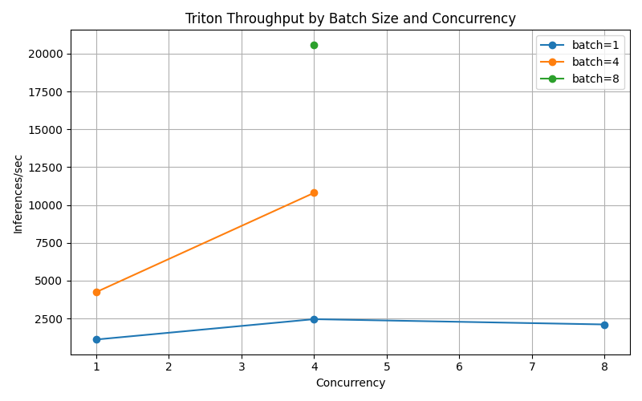
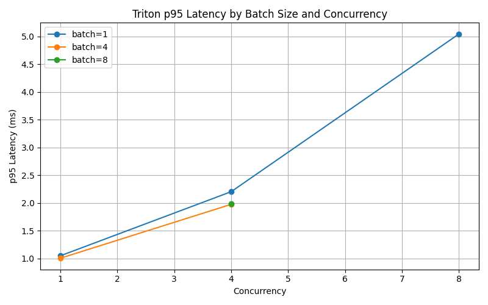

# Triton Inference Lab

## Overview
This project is a local NVIDIA Triton inference lab built to develop hands-on experience with GPU-backed model serving, benchmarking, and observability. Using WSL2, Docker, Prometheus, and Grafana, I validated inference workflows, measured throughput and latency under different batch and concurrency settings, and visualized Triton metrics through a monitoring dashboard.

The lab is focused on practical AI infrastructure skills relevant to model serving and inference performance analysis.

## Environment
- Host: Windows PC
- Linux environment: WSL2 Ubuntu
- Container runtime: Docker Desktop with WSL integration
- GPU: NVIDIA GeForce RTX 5080
- Triton version: 26.03
- Model used: `simple` example model

## What I Built
- Brought up Triton Inference Server in Docker with GPU access
- Validated health, readiness, model metadata, and metrics endpoints
- Sent inference requests to the `simple` model and verified expected outputs
- Built Python benchmark scripts to test:
  - batch size = 1, 4, 8
  - concurrency = 1, 4, 8
- Captured benchmark output to text files and CSV
- Generated throughput and p95 latency charts from benchmark results
- Configured Prometheus to scrape Triton metrics
- Built Grafana dashboards to visualize counters and rates during benchmark runs

## Repository Layout

    triton-inference-lab/
    ├── README.md
    ├── .gitignore
    ├── scripts/
    │   ├── triton_benchmark.py
    │   └── plot_benchmark.py
    ├── models/
    │   └── simple/
    ├── requests/
    │   ├── simple_request.json
    │   ├── simple_request_bs4.json
    │   └── simple_request_bs8.json
    ├── artifacts/
    │   ├── benchmark_results.csv
    │   ├── throughput_chart.png
    │   ├── latency_chart.png
    │   ├── benchmark_run_01.txt
    │   ├── benchmark_run_02_concurrency.txt
    │   ├── benchmark_run_03_latency.txt
    │   ├── benchmark_run_04_csv.txt
    │   └── notes.txt
    └── docs/
        ├── setup_notes.md
        └── prometheus_grafana_setup.md

## Triton Validation
The initial phase of the lab focused on validating a complete Triton workflow:
- confirmed Triton health and readiness endpoints
- confirmed model metadata endpoint
- submitted inference requests to the `simple` model
- verified returned outputs matched expected add/subtract behavior
- confirmed Triton metrics changed as traffic was generated

This established a working baseline before moving into performance testing and observability.

## Benchmark Matrix
The benchmark tested combinations of:
- Batch size 1, concurrency 1
- Batch size 1, concurrency 4
- Batch size 1, concurrency 8
- Batch size 4, concurrency 1
- Batch size 4, concurrency 4
- Batch size 8, concurrency 4

## Key Findings
1. Increasing batch size significantly improved inference throughput.
   - Larger batches increased the amount of useful work completed per request.
   - Batch size 8 with concurrency 4 produced the highest inference throughput in this lab.

2. Moderate concurrency improved throughput, but higher concurrency did not always help.
   - Moving from concurrency 1 to 4 improved throughput substantially.
   - Moving from concurrency 4 to 8 for batch size 1 increased latency without delivering proportional throughput gains.

3. Tail latency increased as concurrency increased.
   - p95 and p99 latency were noticeably higher at concurrency 8 than at concurrency 4 for batch size 1.
   - This suggests that higher concurrency introduced overhead or contention in this setup.

4. Batch size and concurrency affect different parts of performance.
   - Batch size increased work per request.
   - Concurrency increased the number of requests in flight.
   - The best operating point in this test appeared to be a balance of moderate concurrency and larger batch sizes.

## Best Observed Configurations
- Best small-request latency: batch size 1, concurrency 1
- Best small-request throughput balance: batch size 1, concurrency 4
- Best overall throughput: batch size 8, concurrency 4
- Best overall balance of throughput and latency: batch size 4, concurrency 4

## Real Model Serving
Extended the lab from the `simple` test model to a real ONNX image-classification model (`densenet_onnx`). Validated model loading, readiness, metadata, and end-to-end image inference using the Triton SDK client.

A sample inference against `mug.jpg` returned top classifications of:
- COFFEE MUG
- CUP
- COFFEEPOT

This added:
- real ONNX model serving through Triton
- end-to-end image classification inference
- a more realistic model-serving workflow beyond synthetic test models

## Observability
Prometheus was configured to scrape Triton metrics, and Grafana was used to visualize model-serving activity during benchmark runs.

### Dashboard Panels
- Request Success Count
- Inference Count
- Execution Count
- Request Rate
- Inference Rate

This made it possible to:
- confirm Triton counters increased as expected during test runs
- observe live request and inference rates while traffic was generated
- connect benchmark behavior to real-time monitoring views

## Charts

### Throughput

### p95 Latency

## Artifacts
- `artifacts/benchmark_results.csv`
- `artifacts/throughput_chart.png`
- `artifacts/latency_chart.png`
- `artifacts/benchmark_run_01.txt`
- `artifacts/benchmark_run_02_concurrency.txt`
- `artifacts/benchmark_run_03_latency.txt`
- `artifacts/benchmark_run_04_csv.txt`

## Resume-Relevant Takeaways
- Built and benchmarked a local NVIDIA Triton inference lab with GPU acceleration
- Measured request throughput, inference throughput, and latency across batch-size and concurrency scenarios
- Used Triton metrics to analyze request count, inference count, and execution behavior
- Added Prometheus and Grafana to visualize Triton model-serving metrics during benchmark testing

## Next Steps
- Add GPU telemetry with DCGM Exporter
- Serve a more realistic ONNX or generative AI model through Triton
- Compare Triton behavior across different model types
- Move the lab into Kubernetes with NVIDIA GPU Operator
- Expand benchmark automation and dashboarding
